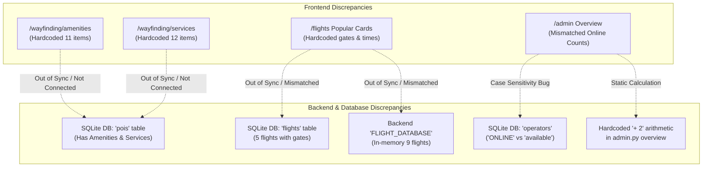

# Comprehensive Application Audit & Data Reconciliation Report

This report provides a full breakdown of all pages, their current content, data sources (dynamic vs. hardcoded), and identified data reconciliation discrepancies across the **Flyer Airport Kiosk & Enterprise Management System**.

---

## Executive Summary of Discrepancies

| Domain | UI / Frontend State | Backend / DB State | Reconciliation Issue |
| :--- | :--- | :--- | :--- |
| **Operators Count & Status** | Admin overview displays **3 Online** (or 0 if signaling is idle) | Database has **6 operators** (3 with status `'ONLINE'`, 3 with status `'available'`) | **Case-sensitivity bug**: Backend filters `status == "available"`, excluding `'ONLINE'` operators. |
| **Connected Devices** | Admin overview computes `online = online_kiosks + 2` | `devices` table has **7 devices** (6 online, 1 warning) | **Hardcoded arithmetic**: Online count is statically calculated rather than querying `devices.status == 'online'`. |
| **Kiosks vs. Devices** | Kiosk screens use `T3-L1-K04`, `T2-A87`, `T1-D12` (`kiosks` table) | Fleet manager uses `KIOSK-T3-L1-01` to `04`, `SCANNER-GATE-B12`, `OP-DESK-01` (`devices` table) | **Dual table bifurcation**: Disconnect between physical `kiosks` records and telemetry `devices` records. |
| **Popular Flights** | `/flights` renders hardcoded `POPULAR_FLIGHTS` (e.g., EK 511 as *ON TIME*, Gate 24) | SQLite `flights` table has EK 511 as *GATE_CHANGE*, Gate A17; `main.py` has in-memory `FLIGHT_DATABASE` | **3-way split**: DB table, in-memory backend list, and frontend static constant all contain differing flight details and gates. |
| **Airport Amenities** | `/wayfinding/amenities` renders a static `AMENITIES` array (11 items) | SQLite `pois` table contains POIs (Restrooms, etc.) and `/admin` allows CRUD | **Zero API integration**: Amenities page does not fetch from `/api/v1/directory?category=Amenities`. |
| **Airport Services** | `/wayfinding/services` renders a static `SERVICES` array (12 items) | SQLite `pois` table contains Services and `/admin` allows CRUD | **Zero API integration**: Services page does not fetch from `/api/v1/directory?category=Services`. |
| **Boarding Gates** | `/wayfinding/gates` renders static `ALL_GATES` (Gates 20–37, B1–B6) | `pois` table has `Gate 14 Boarding Area` and `flights` table has active gates | **Static isolation**: Gate statuses and walk-times are hardcoded and decoupled from flight assignments. |
| **Baggage Belts** | Fallback array has Carousel 04, 02, 09, 06 | `Backend/main.py` returns hardcoded 3-belt list; `flights` table has carousels 1, 2, 4, 5, 9 | **Decoupled data**: Baggage API does not query the active flight table belts. |
| **Network Telemetry** | Admin dashboard displays Health 99.8%, Latency 18ms, Socket Connected | `Backend/routes/admin.py` hardcodes fixed values in JSON response | **Mock Telemetry**: Network health values are static placeholders. |

---

## 1. Page-by-Page Content & Architecture Audit

### 1.1 Admin Portal (`/admin`)
* **Path**: [page.tsx](file:///c:/StudyApplication/Flyer/Frontend/app/admin/page.tsx)
* **Tabs**:
  1. **Overview**: Metric KPI tiles (Kiosks Online, Total Operators, Scan Success Rate, Total Devices, POIs/Amenities, System Actions, Network Score).
  2. **Connected Devices**: Fleet table listing Device ID, Name, Type, IP/MAC, Location, Ping, CPU/RAM, Hardware diagnostics (Screen, Scanner, Camera), Reboot & Ping actions.
  3. **Workforce Management**: Operator list, status badges (Online, Available, Busy, Offline), shift details, password reset modal, create/edit operator modal.
  4. **Boarding Pass Scans**: Scan log audit table (Passenger, Flight, PNR, Seat, Barcode Format, Result, Failure Reason, Timestamp, Raw Payload Viewer).
  5. **User Actions Audit**: Real-time event log (Kiosk ID, Session ID, Action Type, Details, Metadata, IP Address).
  6. **Airport Amenities / POIs**: Directory taxonomy manager, categorized POI cards, coordinate editor, toggle active status, add/edit/delete POI modals.
* **Data Sources**: Dynamic calls to `/api/v1/admin/*`.
* **Reconciliation Bugs**:
  * Operator count in overview uses case-sensitive matching (`status == 'available'`), omitting `status == 'ONLINE'`.
  * Online device count uses hardcoded `online_kiosks + 2` calculation.

---

### 1.2 Operator Workstation (`/operator/*`)
* **Routes**:
  * [`/operator/login`](file:///c:/StudyApplication/Flyer/Frontend/app/operator/login/page.tsx): Authentication against `/api/v1/operator/login`.
  * [`/operator/dashboard`](file:///c:/StudyApplication/Flyer/Frontend/app/operator/dashboard/page.tsx): Metric tiles (Inbound calls, avg duration, resolution rate, active operators), live call queue, call history log with recording playback.
  * [`/operator/incoming`](file:///c:/StudyApplication/Flyer/Frontend/app/operator/incoming/page.tsx): Live incoming call queue monitor with Accept/Decline actions.
  * [`/operator/call`](file:///c:/StudyApplication/Flyer/Frontend/app/operator/call/page.tsx): WebRTC 2-way audio/video interface, screen annotation canvas, mute/camera controls, call termination.
  * [`/operator/call-log`](file:///c:/StudyApplication/Flyer/Frontend/app/operator/call-log/page.tsx): Post-call profiling submission form (Passenger Name, Flight, PNR, Issue Category tags, Operator Notes, Recording Link).
  * [`/operator/annotation`](file:///c:/StudyApplication/Flyer/Frontend/app/operator/annotation/page.tsx): Interactive drawing tool overlay.
  * [`/operator/map-editor`](file:///c:/StudyApplication/Flyer/Frontend/app/operator/map-editor/page.tsx): Floorplan node/edge graph editor.
* **Data Sources**: Dynamic WebRTC signaling (`socket.io`), `/api/v1/operator/*`.
* **Hardcoded Content**:
  * Issue categories in `operator-call-log.tsx` (`Accessibility Services`, `Baggage Services`, etc.) are hardcoded in a static `CATEGORIES` array rather than fetched from an API taxonomy endpoint.

---

### 1.3 Passenger Kiosk - Flights & Baggage
* **Routes**:
  * [`/flights`](file:///c:/StudyApplication/Flyer/Frontend/app/flights/page.tsx): Flight search bar, Popular Flights cards, barcode scan trigger.
  * [`/flights/details`](file:///c:/StudyApplication/Flyer/Frontend/app/flights/details/page.tsx): Flight metadata breakdown (Scheduled/Estimated Time, Terminal, Gate, Check-in Counters, Baggage Carousel, Delay Status, Wayfinding button).
  * [`/baggage`](file:///c:/StudyApplication/Flyer/Frontend/app/baggage/page.tsx): Baggage carousel tracker by flight number with claim area locations.
  * [`/flight-transfer`](file:///c:/StudyApplication/Flyer/Frontend/app/flight-transfer/page.tsx): Inter-terminal shuttle schedule and departure countdowns.
* **Reconciliation Issues**:
  * `flight-info.tsx` renders hardcoded `POPULAR_FLIGHTS` constant that has conflicting gates and statuses compared to the backend SQLite `flights` table and `FLIGHT_DATABASE`.
  * `baggage-belt.tsx` queries `/api/v1/baggage/belts`, which returns a static in-memory 3-flight list instead of pulling dynamic carousel assignments from the SQLite `flights` table.

---

### 1.4 Passenger Kiosk - Directory & Wayfinding
* **Routes**:
  * [`/wayfinding`](file:///c:/StudyApplication/Flyer/Frontend/app/wayfinding/page.tsx): Category tiles (Dining, Shopping, Lounges, Amenities, Services, Gates) - fetches dynamically from `/api/v1/admin/wayfinding/categories`.
  * [`/eat-dine`](file:///c:/StudyApplication/Flyer/Frontend/app/eat-dine/page.tsx): Fetches `/api/v1/directory?category=Dining` (with static fallback).
  * [`/wayfinding/shopping`](file:///c:/StudyApplication/Flyer/Frontend/app/wayfinding/shopping/page.tsx): Fetches `/api/v1/directory?category=Retail` (with static fallback).
  * [`/wayfinding/lounges`](file:///c:/StudyApplication/Flyer/Frontend/app/wayfinding/lounges/page.tsx): Fetches `/api/v1/directory?category=Lounge` (with static fallback).
  * [`/wayfinding/amenities`](file:///c:/StudyApplication/Flyer/Frontend/app/wayfinding/amenities/page.tsx): **Purely hardcoded** `AMENITIES` array (11 items). Never fetches from backend!
  * [`/wayfinding/services`](file:///c:/StudyApplication/Flyer/Frontend/app/wayfinding/services/page.tsx): **Purely hardcoded** `SERVICES` array (12 items). Never fetches from backend!
  * [`/wayfinding/gates`](file:///c:/StudyApplication/Flyer/Frontend/app/wayfinding/gates/page.tsx): **Purely hardcoded** `ALL_GATES` array.
  * [`/directory`](file:///c:/StudyApplication/Flyer/Frontend/app/directory/page.tsx): Global searchable directory (fetches from `/api/v1/directory`).
  * [`/map`](file:///c:/StudyApplication/Flyer/Frontend/app/map/page.tsx) & [`/navigation`](file:///c:/StudyApplication/Flyer/Frontend/app/navigation/page.tsx): Interactive floorplan rendering SVG and Dijkstra navigation path.
  * [`/directions`](file:///c:/StudyApplication/Flyer/Frontend/app/directions/page.tsx): Accessibility selection (Elevator vs. Escalator mode).

---

### 1.5 Passenger Kiosk - Wi-Fi, Feedback & AI
* **Routes**:
  * [`/wifi`](file:///c:/StudyApplication/Flyer/Frontend/app/wifi/page.tsx) & [`/wifi/passport`](file:///c:/StudyApplication/Flyer/Frontend/app/wifi/passport/page.tsx): Mobile OTP flow and Camera Passport MRZ scanning with backend verification `/api/v1/wifi/scan-passport`.
  * [`/feedback`](file:///c:/StudyApplication/Flyer/Frontend/app/feedback/page.tsx), [`/feedback/rating`](file:///c:/StudyApplication/Flyer/Frontend/app/feedback/rating/page.tsx), [`/feedback/identify`](file:///c:/StudyApplication/Flyer/Frontend/app/feedback/identify/page.tsx), [`/feedback/mobile`](file:///c:/StudyApplication/Flyer/Frontend/app/feedback/mobile/page.tsx), [`/feedback/scan`](file:///c:/StudyApplication/Flyer/Frontend/app/feedback/scan/page.tsx): 5-star ratings across categories (Cleanliness, Staff, Wayfinding, Facilities, Security, Overall) submitting to `/api/v1/feedback/submit`.
  * [`/ai-assistant`](file:///c:/StudyApplication/Flyer/Frontend/app/ai-assistant/page.tsx): Voice / text assistant with Groq LLM and local fallback `/api/v1/ai/intent`. Contains demo prompts and directory list in system prompt.
  * [`/support`](file:///c:/StudyApplication/Flyer/Frontend/app/support/page.tsx), [`/support-call`](file:///c:/StudyApplication/Flyer/Frontend/app/support-call/page.tsx), [`/call-ended`](file:///c:/StudyApplication/Flyer/Frontend/app/call-ended/page.tsx), [`/thank-you`](file:///c:/StudyApplication/Flyer/Frontend/app/thank-you/page.tsx): Passenger-side WebRTC live support video call.

---

## 2. Deep Reconciliation Analysis: Scenarios & Root Causes

### Scenario 1: Operator Workforce Status Reconciliation
* **Scenario**: Admin visits Overview or Operator table. The Overview card shows 3 Online operators, but the Operator table shows 6 active operators.
* **Root Cause**:
  1. `seed.py` seeded 3 operators with status `'ONLINE'`.
  2. `admin.py` seeded/migrated operators with status `'available'`.
  3. In `Backend/routes/admin.py` line 151:
     `online_operators_count = db.query(Operator).filter(Operator.status == "available").count()`
     This exact match omits operators whose status is `'ONLINE'`.
* **Fix**: Normalize status casing in database (all uppercase or lowercase) and query with case-insensitive match: `db.query(Operator).filter(func.lower(Operator.status).in_(["available", "online"])).count()`.

### Scenario 2: Connected Devices Fleet vs. Kiosk Table
* **Scenario**: Admin overview reports device count calculated with hardcoded arithmetic (`online: online_kiosks + 2`), and the system has two separate tables for kiosks (`kiosks` and `devices`).
* **Root Cause**:
  * In `Backend/routes/admin.py` line 185:
    `"online": online_kiosks + 2`
  * `kiosks` table has 3 rows (`T3-L1-K04`, `T2-A87`, `T1-D12`), while `devices` table has 7 rows (`KIOSK-T3-L1-01` through `04`, etc.).
* **Fix**: Calculate online devices directly from `db.query(Device).filter(Device.status == "online").count()`. Unify kiosk identifiers between `devices` and `kiosks`.

### Scenario 3: Passenger Amenities & Services vs. Admin POI Manager
* **Scenario**: Admin adds a new Water Dispenser or Baby Care room in `/admin` (Airport Amenities tab). When a passenger visits `/wayfinding/amenities`, the new item never appears.
* **Root Cause**:
  * `airport-amenities.tsx` and `airport-services.tsx` use static constants (`AMENITIES` and `SERVICES`) and do not call `fetchDirectoryByCategory('Amenities')` or `fetchDirectoryByCategory('Services')`.
* **Fix**: Update `airport-amenities.tsx` and `airport-services.tsx` to call `fetchDirectoryByCategory` like `eat-dine.tsx`, `shopping.tsx`, and `lounges.tsx` do, keeping the static array only as a fallback.

### Scenario 4: Flight Schedules, Statuses & Baggage Carousels
* **Scenario**: On the passenger flights page (`/flights`), IndiGo 6E 203 shows as "ON TIME" at Gate 24, but searching flight 6E 203 shows "DELAYED" at Gate B14, and in the database flight EK 511 is "GATE_CHANGE" while the popular card says "ON TIME".
* **Root Cause**:
  * `flight-info.tsx` has a static `POPULAR_FLIGHTS` list with hardcoded gate numbers and departure times.
  * `Backend/main.py` has an in-memory `FLIGHT_DATABASE` list with its own values.
  * `Backend/models.py` has a SQLite `flights` table with yet another set of values.
* **Fix**: Connect `/flights` popular flights card to fetch live data from `/api/v1/flights/search`, and synchronize `FLIGHT_DATABASE` with the SQLite `flights` table.

---

## 3. Recommended Remediation Roadmap

1. **Backend Standardization**:
   * Normalize all operator statuses to uppercase (`AVAILABLE`, `BUSY`, `OFFLINE`).
   * Update `get_admin_overview` to compute real device counts (`Device.status == 'online'`) and case-insensitive operator counts.
   * Unify `flights` table as single source of truth for flight search and baggage carousel assignments.
2. **Frontend Dynamic Integration**:
   * Refactor `airport-amenities.tsx` and `airport-services.tsx` to fetch from `fetchDirectoryByCategory`.
   * Refactor `boarding-gates.tsx` to fetch from dynamic gate directory / flights.
   * Refactor `flight-info.tsx` popular flights section to load dynamically from `/api/v1/flights/search`.
   * Move `CATEGORIES` in `operator-call-log.tsx` to use backend taxonomy.
